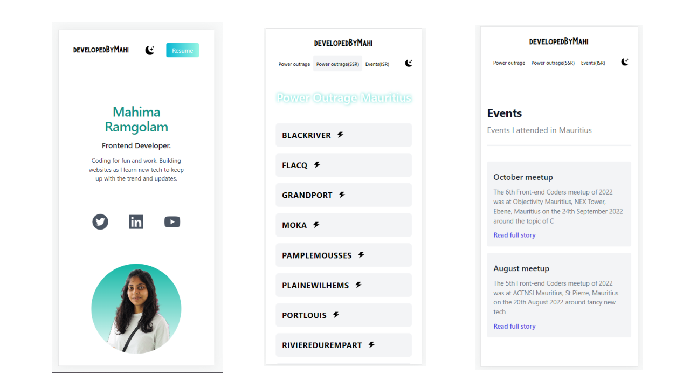

##### Mahima Ramgolam Portfolio

### Built using NextJS and Tailwind CSS

- Dark Mode available :)
- Responsive
- Site is live ✨ - https://mahima-portfolio-nextjs.netlify.app/
- A Power outrage page showcasing with live/real data of electricity outrages in mauritius
  ( using different approach - static, SSR & ISR )
- An event page using (DirectUs API)

##### <u>Preview</u>

 

##### Setup

```bash
npm install
```

##### To run app

```bash
npm run dev
```
